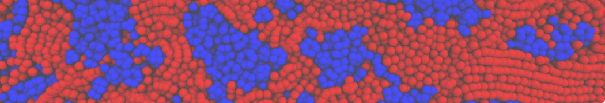

I am a postdoctoral fellow in the group of [Prof. Juan J. de Pablo](https://pme.uchicago.edu/group/de-pablo-group) 
at the [Pritzker School of Molecular Engineering](https://pme.uchicago.edu/), 
[University of Chicago](https://www.uchicago.edu/) (US). 
I have obtained my PhD from the [University of Groningen](https://www.rug.nl/) (NL) working in the group 
of [Prof. Siewert J. Marrink](https://www.rug.nl/research/molecular-dynamics),
home to the [Martini coarse-grained force field](http://cgmartini.nl/). 
Previously, I earned a MSc in Theoretical Chemistry and Computational Modelling 
([TCCM](https://www.emtccm.org/)) at the [University of Groningen](https://www.rug.nl/) (NL),
with a short stay at the [Université Toulouse III - Paul Sabatier](https://www.univ-tlse3.fr/) (FR). 

