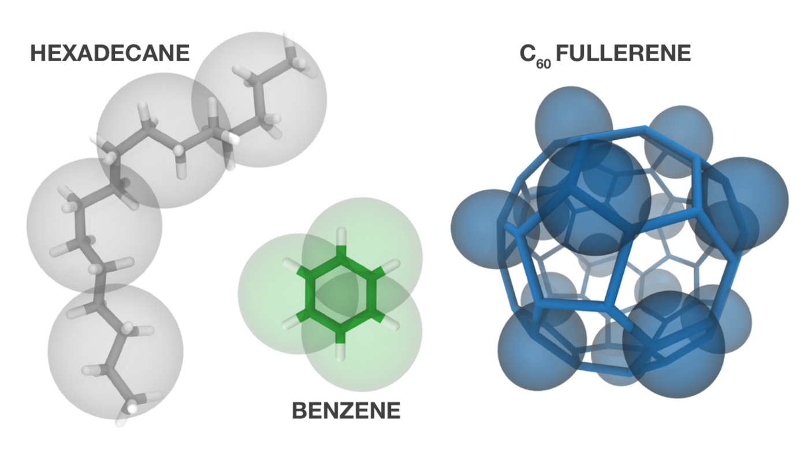

## Coarse-grained modeling of the morphology of soft materials

    

    
 
We modeled the morphologies of organic solar cells with coarse-grained simulations based on the Martini model [<a href="https://doi.org/10.1021/jacs.6b11717">J. Am. Chem. Soc. 2017</a>]. The approach explicitly simulates the solvent evaporation process which takes place during the formation of such morphologies; moreover, the approach allows to retain a good degree of chemical detail while allowing to reach relevant length scales [<a href="https://doi.org/10.1021/jacs.6b11717">J. Am. Chem. Soc. 2017</a>, <a href="https://doi.org/10.1002/adfm.202004799">Adv. Funct. Mater. 2020</a>]. 

The method also proved useful in elucidating host-dopant miscibility in organic semiconductor blends for thermoelectric applications [<a href="https://doi.org/10.1039/C7TA06609K">J. Chem. Mater. 2017</a>], as we teamed up with the groups of <a href="https://www.rug.nl/research/zernike/photophysics-and-opto-electronics/koster-group">Prof. Koster</a> and <a href="https://www.rug.nl/research/bio-organic-materials-devices/">Prof. Hummelen</a>. In this context, a minimalistic Martini-based approach proved also very insightful in predicting the miscibility of a small-molecule dopant in environments of different polarity [<a href="http://doi.org/10.1002/adma.201704630">Adv. Mater. 2018</a>]. 

## Multiscale modeling of soft materials

    

    
 The morphologies obtained with the coarse-grained simulations described above can be promptly backmapped to atomistic resolution, allowing for detailed studies of electronic properties by quantum chemical calculations [<a href="https://doi.org/10.1021/jacs.6b11717">J. Am. Chem. Soc. 2017</a>, <a href="https://doi.org/10.1002/adfm.202004799">Adv. Funct. Mater. 2020</a>]. In particular, we studied the impact that introducing polar side chains on the electron-acceptor molecule has on the energy levels of such materials [<a href="https://doi.org/10.1002/adfm.202004799">Adv. Funct. Mater. 2020</a>].

With <a href="https://twitter.com/anna_s_bond">Anna</a>, we investigated the effect of the environment around dye molecules in large-scale double-walled nanotubes with a combination of quantum-chemical and microelectrostatic calculations [<a href="https://doi.org/10.1039/D0SC03110K">Chem. Sci. 2020</a>, <a href="http://doi.org/10.1021/jacs.0c07392">J. Am. Chem. Soc. 2020</a>]. 

## Development of coarse-grained models

    

    
 We individuated and characterized the limits of the Martini coarse-grained model in a recent study [<a href="http://doi.org/10.1021/acs.jctc.9b00473">J. Chem. Theory Comput. 2019</a>]. This work opened the way for the development of a new version of the force field, dubbed Martini 3, of which I have been a core developer. Among other things, we paid particular attention to aspects of the model important for describing soft materials. [<a href="http://cgmartini.nl/index.php/martini3beta">The Martini 3 open-beta parameters are available here</a>].

We put together a perspective of the state of the Martini model in materials science, a relatively recent field for the applications of this model [<a href="https://arxiv.org/abs/2012.07194">arxiv 2020</a>]. 

